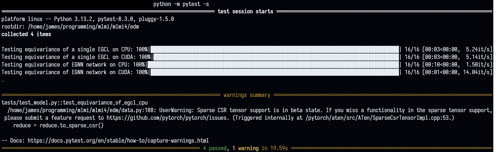

# MLMI4 Group 10
# Setting up
To create a conda environment with `python==3.13` and install the packages required for this project, run the following code.
```python
conda create --prefix ./.conda python=3.13
conda activate ./.conda
pip install -r requirements.txt
```

# Metrics on pre-trained weights
To calculate an estimate of NLL on the pretrained weights using the test set, run the following code:
```
python run.py --pipeline=test --seed=42 --reruns=5 --checkpoint=./pretrained/<extension_name>
```
`<extension-name>` is any one of `'vanilla-with-h'`, `'vanilla-without-h'`, `'variance-with-h'` or `'variance-without-h'`,

The following table summarises the result of running this command:
|**Estimate of NLL**|No extensions (vanilla)|Learning variance|
|---|----|---|
|With hydrogens|`-111.44 (0.98)`|`-121.64 (0.69)`|
|Without hydrogens|`-22.96 (0.71)`|TODO|

The extension and model hyperparameters are automatically activated based on the contents of `args.pkl` in the checkpoint folder.

You may specify `--pipeline=valid` if you would like to calculate metrics using the validation set.

## Extension: variance
To train:
```
run.py --extension=variance --pipeline=train --run_name=ext_variance
```
This creates a folder `./checkpoints/ext_variance` with the model checkpoints

To continue from a checkpoint, run
```
run.py --checkpoint ./checkpoints/ext_variance
```

To estimate the NLL from a checkpoint on the validation dataset, run
```
run.py --checkpoint ./checkpoints/ext_variance --pipeline=valid --reruns=5 --seed=42 
```
This will set the random seed with 42 and go through 5 passes of the validation dataset and calculate metrics on both model.pth and model_ema.pth, returning the mean and standard deviations


To generate and save some molecules, run
```
run.py --checkpoint=./checkpoints/ext_variance --pipeline=sample --batch-size=8 --num-samples=15
```

## Testing with PyTest
To run the tests, activate the conda environment with `conda activate ./.conda` and run the following code.
```
python -m pytest -s
```

This should give output similar to (more extensive than) the following.

